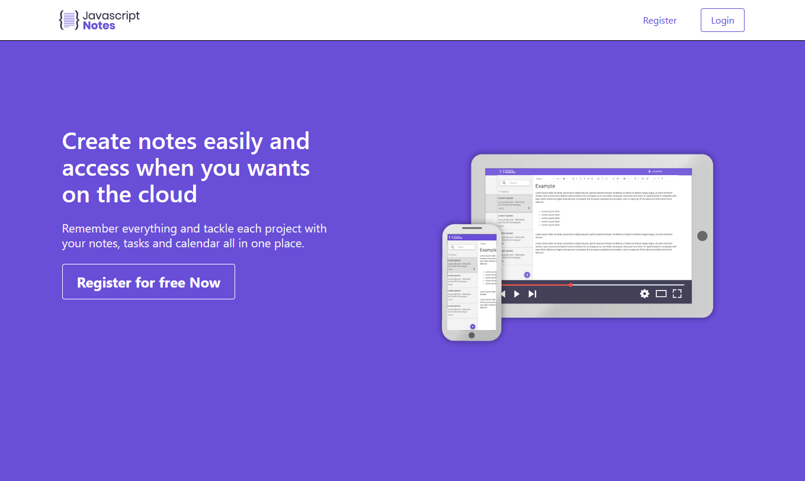

<h1 align="center">Clone Evernote</h1>
<h3 align="center">
  
  
  
  
  
</h3>
<h3>💻 Sobre: </h3>

Projeto desenvolvido para o curso Programador FullStack. O projeto consiste em um clone da aplicação Evernote, onde é possível se registrar, fazer login, criar e excluir notas

<h3>🛠 Tecnologias utilizadas: </h3>
<ul>
  <li>Nodejs</li>
  <li>MongoDB</li>
  <li>ReactJs</li>
  <li>Bulma</li>
  <li>Sass</li>
  <li>Rbx</li>
  <li>Insomnia</li>
</ul

<h3>📟 Layout da aplicação:</h3>

<h3>⚙️ Instalação: </h3>
  
    
Necessário ter o MongoDB instalado

    # Clone o repositório
    $ git clone <https://github.com/Lenondiedrich/clone_evernote>

<h4>Backend</h4>
  
    #Navegue até o diretório production/javascript_note_api
    $cd production/javascript_note_api
    
    #Instale as dependências
    $npm i ou yarn
  
    #Instale o Nodemon
    $npm i nodemon
  
    #Rode a aplicação
    $npx nodemon start
<h4>Frontend</h4>

    # Navegue até o diretório javascript_note
    $ cd javascript_note

    # Instale as dependências da aplicação
    $ npm install ou yarn

    # Inicie a aplicação React
    $ npm start

A aplicação irá rodar no endereço `http://localhost:3000/`

<h3>📝 Licença</h3>

Este projeto está sob a licença do MIT

